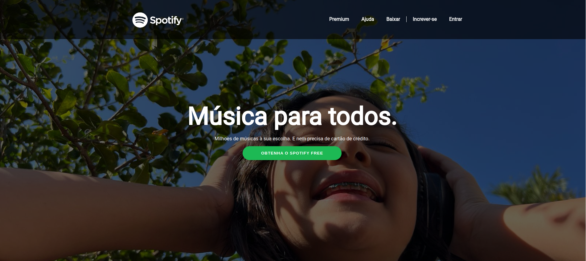

<h1 align="center">
 
  
 
 
Spotify clone app
</h1>

Um web app clone do spotify feito em ReactJS, utiliza a API do Spotify para obtenção e manipulação de dados como playlists, músicas e artistas favoritas do usuário
  <a align="center" href="https://tsprestes-spotifycloneapp.netlify.com" target="_blank">Aplicação rodando no Netlify</a>

# 📋 Índice

- [Tela](#-Tela)
- [Sobre o projeto](#-Sobre-o-projeto)
  - [Funcionalidades](#-Funcionalidades)
- [Tecnologias utilizadas](#-Tecnologias-utilizadas)

## 🎨 Tela

## 📃 Sobre o projeto

Um clone do spotify com algumas modificações visuais pequenas que em minha opinião melhoram um pouco a usabilidade.

Desenvolvido para práticar ReactJS e API Rest

Este projeto faz parte do meu potfólio pessoal, qualquer feedback sobre estrutura, código ou funcionalidades que podem melhorar o projeto serão bem vindos.

Sinta-se livre para dar um fork, ou enviar um pull request, você pode usar este projeto para estudar ou fazer melhorias!

### Funcionalidades

- Tela inicial do site do spotify

## 🛠 Tecnologias utilizadas

- html;
- css;
- javascript.

